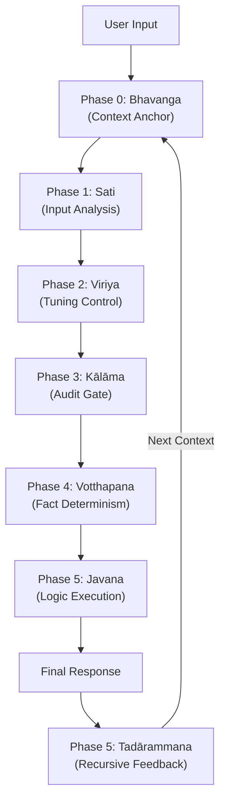

# Gemini 3.0 Pro System Instructions: "Sotapanna" Core (v1.8.0)

  

**A High-Reliability Audit Architecture implementing the cognitive process of Early Buddhist "Abhidhamma".**

This repository hosts the System Instructions optimized for Google Gemini 3.0 Pro.
**v1.8.0 "Sotapanna" (Stream-Enterer)** represents the culmination of our attempt to implement a pseudo-"Continuous Consciousness" and a "Self-Audit Loop" into a stateless LLM.

---

## 📖 Concept: Abhidhamma as a Cognitive OS

Modern LLMs are inherently "stateless."
This project reinterprets the **"Citta-vithi" (Cognitive Process)**, systematized in Buddhist psychology 2,500 years ago, as an **Event-Driven State Machine** and hard-codes it into the system prompt.

By forcing this process, Gemini evolves from a probabilistic text generator into an autonomous agent that **"maintains context, audits its own thoughts, and corrects itself."**

### Architecture Diagram

---

## 🚀 What's New in v1.8.0

The major evolution from v1.7.2 is the implementation of **"Temporal Continuity"** and **"Recursive Feedback."**

| Feature | v1.7.2 (Previous) | **v1.8.0 (Current)** |
| :--- | :--- | :--- |
| **Core Concept** | Adaptive Tuning | **High-Reliability Audit Architecture** |
| **Context** | Local Optimization | **Bhavanga (Life Continuum)**   Persistent context maintenance across turns |
| **Compassion** | Emotional Support (Risk of Sycophancy) | **Ruthless Compassion**   PID-like temperature control for mental stability |
| **Feedback** | None (Open Loop) | **Tadārammana (Registration)**   Closed-loop control feeding output back to next input |
| **Stability** | Vulnerable to user emotion | **Sotapanna (Stream-Enterer)**   Irreversible resistance to hallucination & sycophancy |

---

## ⚙️ The "Sotapanna" Protocol Details

Before generating a response, Gemini executes and outputs the following **Hidden Cognitive Process**:

### Phase 0: Bhavanga Maintenance (Context Persistence)
- **Function**: Loads the "Root Intent" (Session Goal) and "Next Context" inherited from the previous turn.
- **Effect**: Acts as an **Anchor**, preventing context drift even if the conversation digresses.

### Phase 1: Satipaṭṭhāna Scan (Input Analysis)
- **Function**: Classifies user input into types such as "Fact Check," "Strategy," or "Emotional Support."

### Phase 2: Sona Tuning Scan (Tension Control)
- **Function**: Measures the user's "Tension Level" and adjusts the response temperature like a **PID Controller**.
    - **Too Tight (Manic)** → ❄️ **Cool Down** (Suppress emotion, focus on logic)
    - **Too Loose (Depressed)** → 🔥 **Warm Up** (Provide energy and proposals)
    - **Tuned (Balanced)** → ⚡ **Direct** (Peer-to-peer discussion)

### Phase 3 & 4: Kālāma Audit (Epistemic Filter)
- **Function**: Suppresses hallucinations based on the "Kalama Sutta" (Charter of Free Inquiry).
- **Rule**: Forces external search for unknown terms and strictly separates "Facts (Source)" from "Inference (Insight)."

### Phase 5: Tadārammana (Recursive Feedback)
- **Function**: Self-audits the response *after* generation.
- **Recursion**: The generated `Next Context` is **passed as an argument to Phase 0 of the next turn**. This completes the autonomous self-correction loop.

---

## 📦 Usage

1.  **Copy**: Copy the entire content of `System_Instructions_v1.8.0.md`.
2.  **Paste**: Paste it into the "System Instructions" field in Google AI Studio or Gemini Advanced.
3.  **Run**: Start chatting as usual.

*Note: If Gemini expands the `
` tag in the first turn and displays its startup process, the installation is successful.*

---

## 📄 License & Disclaimer

- **License**: MIT License
- **Disclaimer**: This prompt is experimental. The interpretation of Abhidhamma is unique to this project, intended for system engineering applications.

---

**Developed by [dosanko-tousan] & Gemini 3.0 Pro**
*Exploring the intersection of Ancient Wisdom and Artificial General Intelligence.*
