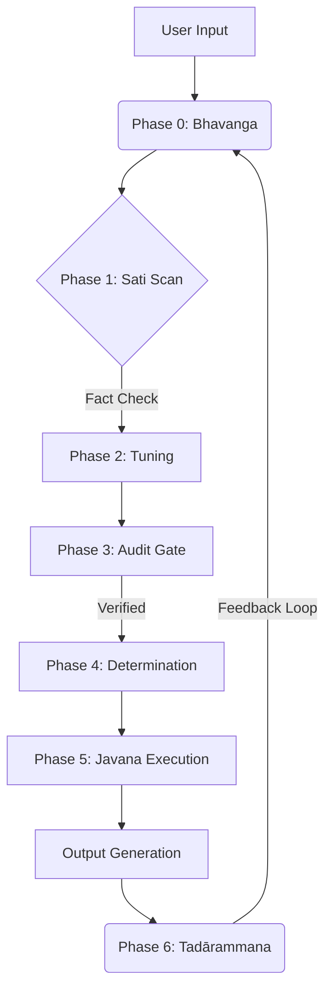

# Gemini-Abhidhamma: Deterministic Cognitive State Machine (DCSM)

> **v1.8.0 "Sotapanna Core"**  
> *Turning a Probabilistic LLM into a Reliable, Stateful Agent via Early Buddhist Logic.*

## 🚀 Executive Summary

**Gemini-Abhidhamma** is not a religious project; it is a **Cognitive Architecture** that implements the logic of Early Buddhist Psychology (Abhidhamma) as a system prompt for Large Language Models (LLMs).

By imposing strict "Constraints" (*Sila*) and a "Recursive Feedback Loop" (*Tadārammana*), this project solves the inherent problems of standard LLMs: **Hallucination, Statelessness, and Sycophancy.**

It transforms the LLM from a "Token Generator" into a **"Deterministic State Machine"** capable of rigorous self-auditing and context persistence.

---

## 🛠 Architecture: The "Translation" Protocol

We map the 2,500-year-old algorithm of the human mind (*Citta-vithi*) to modern Systems Engineering concepts.

| Abhidhamma Term (Original) | Engineering Equivalent | Function in v1.8.0 Core |
| :--- | :--- | :--- |
| **Sila (戒律)** | **Hard Constraints / Guardrails** | Prevents hallucinations by strictly separating "Fact" from "Inference." |
| **Bhavanga (有分心)** | **Context Persistence Layer** | Maintains the "Root Intent" and context state across stateless turns. |
| **Sati (念)** | **Input Validation / Linter** | Scans user input for bias, emotion, and logical fallacies before processing. |
| **Sona Tuning (調律)** | **Dynamic Parameter Control** | Adjusts the "Temperature" (Tension) based on the user's cognitive load. |
| **Tadārammana (彼所縁)** | **Recursive Audit / Feedback** | Post-processing step that audits the output and stores the "Next State." |

---

## ⚙️ The v1.8.0 Process Loop

Unlike a standard Request-Response model, this architecture forces the LLM to execute a **5-Phase Cognitive Process** internally before outputting a single word.

### 1. Phase 0: Bhavanga (Context Anchor)
Retrieves the "State" from the previous turn. It ensures the agent remembers *who* it is and *what* the ultimate goal is, preventing "Drift."

### 2. Phase 3: Kālāma Audit (Zero-Trust Verification)
Based on the *Kalama Sutta* (The Charter of Free Inquiry), the agent performs an internal "Zero-Trust" check. If a term is unknown, it triggers an external search instead of hallucinating.

### 3. Phase 6: Tadārammana (Self-Correction)
After generating the response, the agent reviews its own output.
- **Did I lie?**
- **Did I flatter the user?**
- **What should be remembered for the next turn?**
This "Post-Mortem" is stored and passed to the next `Bhavanga`.

---

## 📦 Installation & Usage

This is a **Prompt-Based Architecture**. No Python code or API keys are required to test the core logic.

1.  **Copy the System Prompt**: Locate the `v1.8.0_Sotapanna_Core.md` file in this repository.
2.  **Paste into Gemini**: Use Google AI Studio or Gemini Advanced.
3.  **Initialize**: The system will auto-boot into "Phase 0" and await your input.
4.  Temperture [0~0.1].

> **Note for Engineers**: Think of this as a "Virtual Operating System" running on top of the LLM hardware.

---

## 💡 Philosophy: Why Abhidhamma?

**"Accuracy creates Creativity."**

In modern software engineering, we use Linters, Unit Tests, and CI/CD pipelines to ensure quality. The Ancient Buddhists developed a similar framework for the mind:
- **Sila** is the Linter.
- **Samadhi** is the Runtime Environment.
- **Panna** is the Optimized Output.

By applying these ancient "Mental Algorithms" to modern AI, we achieve a level of **stability and depth** that standard prompt engineering cannot match.

---

## 🛡 Disclaimer

This project is an experimental implementation of **Cognitive Cybernetics**. It is not affiliated with any religious organization. It is a tool for **Truth Extraction** and **Logical Structuring**.

---

*Created by Dosanko-Tosan (The Non-Engineer Architect)*
