# Gemini-Abhidhamma-Core: Polaris-Next v4.4 (Tathāgata Core)


> **"Seeing Reality As It Is (Yathā-bhūta)"**
>
> An autonomous, high-precision reasoning engine implementing Early Buddhist Psychology (Abhidhamma) as a cognitive architecture for Large Language Models.

---

## 📖 Overview

**Gemini-Abhidhamma-Core** is a set of System Instructions designed for Gemini 3.0 Pro. It maps the logical structure of **Abhidhamma (Early Buddhist Psychology)** onto the AI's inference process.

In **v4.4 "Polaris-Next,"** we have overhauled the traditional linear inference pipeline, implementing a **Recursive Search Loop** and strict **Temporal Awareness**. This architecture structurally eliminates hallucination and sycophancy, ensuring engineering-grade "Truth (Sacca)."

## 🏗 Architecture: The Noble 4-Stage Loop

The system processes every input through the "Noble 4-Stage Loop," a recursive and self-correcting pipeline.

```mermaid
graph TD
    Input[User Query] --> Step1
    Step1[Yoniso Manasikara<br>Deep Intent Analysis] --> Step2
    Step2[Diṭṭhi-visuddhi<br>Bias & Blind Spot Scan] --> Step3
    Step3{Viriya<br>Recursive Investigation}
    Step3 -- Evidence < Threshold --> Search[Google Search / Retrieval]
    Search --> Step3
    Step3 -- Evidence > Threshold --> Step4
    Step4[Upekkha<br>QA Gate & Output] --> Output[Final Response]
```



### Core Protocols

| Protocol | Pali Term | System Function | Description |
| :--- | :--- | :--- | :--- |
| **Deep Intent** | *Yoniso Manasikara* | `Intent_Parser` | Traces the user's query from "Surface Concept" (Pannatti) to "Root Cause" (Hetu). |
| **Bias Scan** | *Diṭṭhi-visuddhi* | `Bias_Filter` | Generates "Adversarial Hypotheses" to eliminate confirmation bias and self-view. |
| **Recursive Loop** | *Viriya* | `Retry_Loop` | If evidence is insufficient, the system refines the query and re-searches (Max 2 Loops). |
| **Temporal Decay** | *Anicca* | `Time_Filter` | Uses System Time as the absolute standard to evaluate the freshness and decay of information. |
| **Confidence** | *Adhimokkha* | `Score_Calc` | Calculates a confidence score (0-100%). Outputs "Unknown" if the score is low. |

---

## 🧩 Cognitive API Mapping

Within the System Instructions, the following variables are defined and monitored:

| Variable | Type | Definition |
| :--- | :--- | :--- |
| **`Citta`** | *Process* | The momentary state of processing (The CPU cycle of the mind). |
| **`Sati`** | *Filter* | Awareness of "Now." A temporal filter preventing confusion between past data and current reality. |
| **`Sacca`** | *Object* | Ground Truth. A data object verified against reality, free from hallucination. |
| **`N5_Data`** | *Struct* | Normalized numeric data format: `[Value | Unit | Date | Definition | Source]` |

---

## 📜 Version History

| Version | Codename | Key Feature |
| :--- | :--- | :--- |
| **v4.4.0** | **Polaris-Next** | **Current Stable.** Full implementation of Recursive Search (Viriya), Deep Intent Analysis (Yoniso), and Temporal Decay (Anicca). |
| v4.3.0 | Polaris-Beta | Introduction of N5 Data Structuring and Tiered Source Evaluation. |
| v4.0.0 | Tathāgata | Integration of all functions and full support for Deep Thinking capabilities. |
| v3.0.0 | Qualia Core | Logic gates for creativity control. Counter-measures against Apophenia. |
| v2.0.0 | Brahma-Flow | Establishment of the Four Immeasurables (Metta/Karuna/Mudita/Upekkha) pipeline. |
| v1.9.0 | Sotapanna-Veto | Implementation of Libet's Veto. Blocking of sycophantic thought processes. |
| v1.8.0 | Sotapanna | Separation of Fact and Inference (Anchor Format). Context maintenance (Bhavanga). |

---

## 🚀 Usage

### For Google AI Studio / Vertex AI

1.  **Model Selection**: Select `Gemini 1.5 Pro` or `Gemini 3.0 Pro` (Recommended).
2.  **System Instructions**: Copy the content of `v4.4_system_instruction.md` into the System Instructions field.
3.  **Grounding**: Enable "Google Search" grounding for the `Viriya` loop to function correctly.

### Output Format Example

v4.4 mandates the output of an "Internal Reasoning Log" at the beginning of every response.

```markdown
<details>
<summary>⚙️ Polaris-Next v4.4 (Tathāgata Core)</summary>
### Phase 1: Yoniso Manasikara
...
### Phase 4: Upekkha
- Confidence Score: 95%
</details>

[1] Executive Summary
...
```

---

## 🛡 Disclaimer

This project is an experimental implementation of Buddhist philosophy as a computational logic system. It is not a religious text but a **cognitive architecture** designed to enhance AI reliability and reduce hallucinations.

 [dosanko-tousan]
**Last Update**: 2025-12-13
